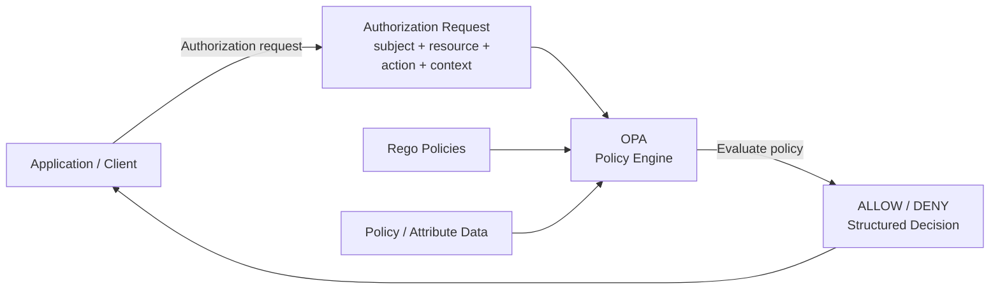
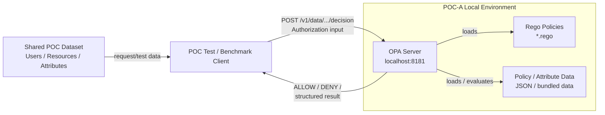

## Architecture diagram
```
Test / benchmark client
        │
        ▼
   OPA HTTP API
        │
        ▼
  Rego policy evaluation
        │
        ├── policy files
        ├── request input
        └── optional policy data
```

## OPA + Rego runtime evaluation


## Runtime flow
```
Request
   ↓
OPA
   ├── Rego Policy
   ├── Policy / Attribute Data
   └── Request Input
          ↓
      Policy evaluation
          ↓
      ALLOW / DENY
```

----------------------------------------------------
# Additional (runtime specific - full flow)
----------------------------------------------------

## Current runtime architecture


### Actual request path
```
Benchmark / test client
        ↓
OPA
        ↓
Rego
        ↓
decision
```