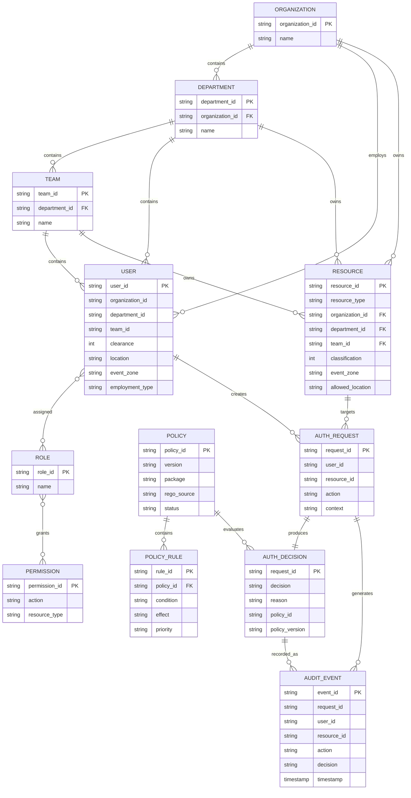

## ER diagram 

```mermaid
erDiagram

    USER {
        string user_id PK
        string organization_id
        string department_id
        string team_id
        int clearance
        string location
        string event_zone
        string employment_type
    }

    ORGANIZATION {
        string organization_id PK
        string name
    }

    DEPARTMENT {
        string department_id PK
        string organization_id FK
        string name
    }

    TEAM {
        string team_id PK
        string department_id FK
        string name
    }

    ROLE {
        string role_id PK
        string name
    }

    PERMISSION {
        string permission_id PK
        string action
        string resource_type
    }

    RESOURCE {
        string resource_id PK
        string resource_type
        string organization_id FK
        string department_id FK
        string team_id FK
        int classification
        string event_zone
        string allowed_location
    }

    POLICY {
        string policy_id PK
        string version
        string package
        string rego_source
        string status
    }

    POLICY_RULE {
        string rule_id PK
        string policy_id FK
        string condition
        string effect
        string priority
    }

    AUTH_REQUEST {
        string request_id PK
        string user_id
        string resource_id
        string action
        string context
    }

    AUTH_DECISION {
        string request_id PK
        string decision
        string reason
        string policy_id
        string policy_version
    }

    AUDIT_EVENT {
        string event_id PK
        string request_id
        string user_id
        string resource_id
        string action
        string decision
        timestamp timestamp
    }


    ORGANIZATION ||--o{ DEPARTMENT : contains
    DEPARTMENT ||--o{ TEAM : contains
    DEPARTMENT ||--o{ USER : contains
    TEAM ||--o{ USER : contains

    ORGANIZATION ||--o{ USER : employs
    USER }o--o{ ROLE : assigned
    ROLE }o--o{ PERMISSION : grants

    ORGANIZATION ||--o{ RESOURCE : owns
    DEPARTMENT ||--o{ RESOURCE : owns
    TEAM ||--o{ RESOURCE : owns

    POLICY ||--o{ POLICY_RULE : contains

    USER ||--o{ AUTH_REQUEST : creates
    RESOURCE ||--o{ AUTH_REQUEST : targets

    AUTH_REQUEST ||--|| AUTH_DECISION : produces
    POLICY ||--o{ AUTH_DECISION : evaluates

    AUTH_REQUEST ||--o{ AUDIT_EVENT : generates
    AUTH_DECISION ||--o{ AUDIT_EVENT : recorded_as
```