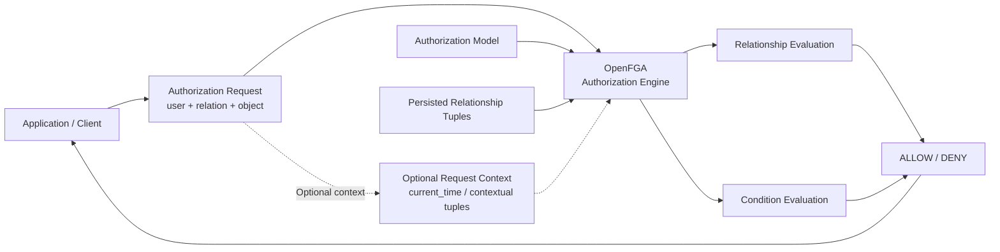
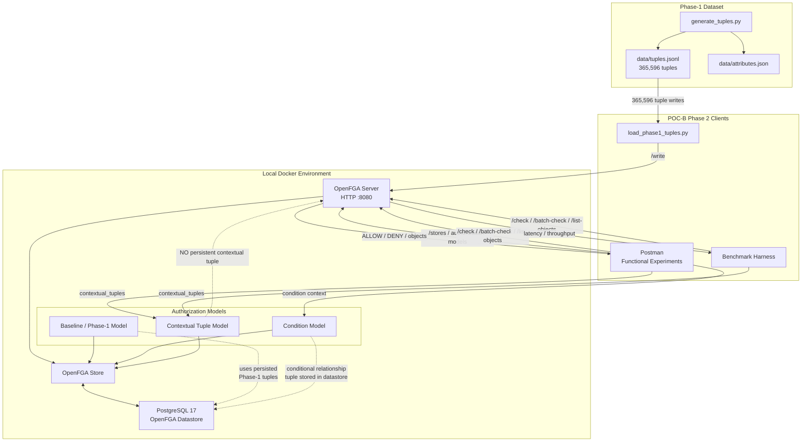
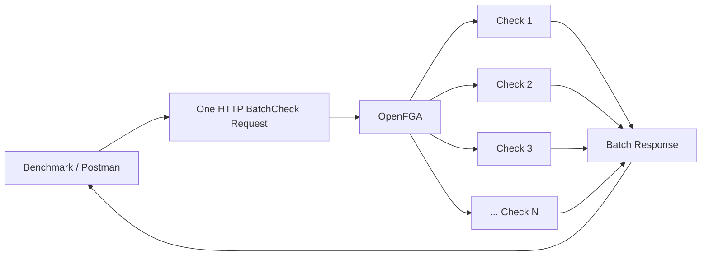
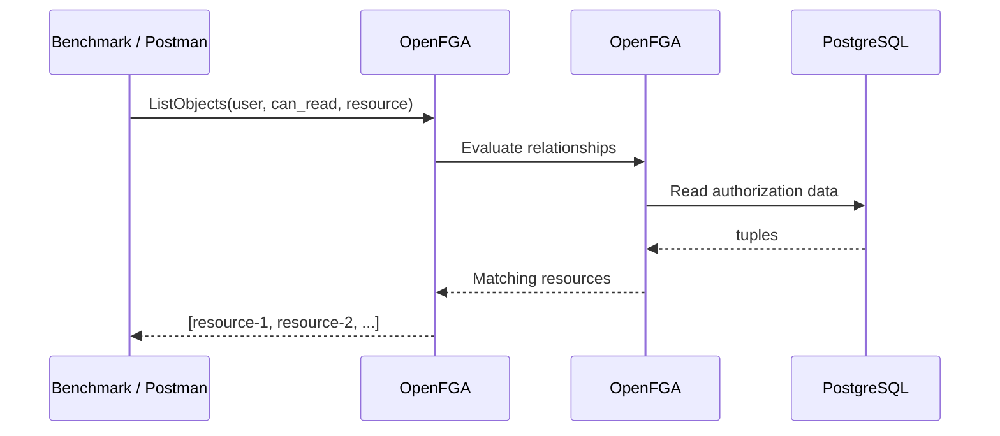
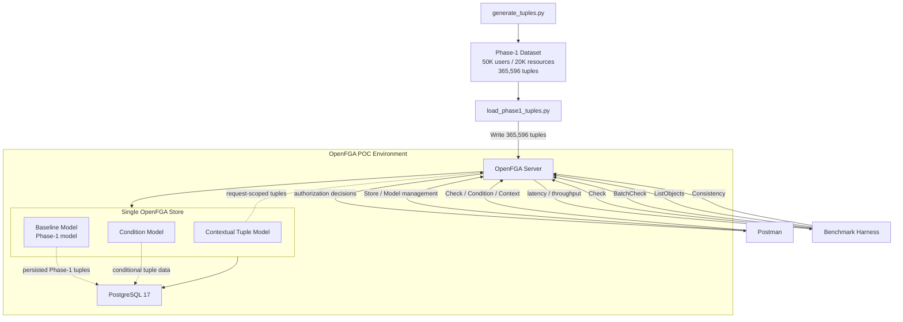

## OpenFGA advanced runtime evaluation


## Runtime concept
```
                    Authorization Request
                            │
                            ▼
                       OpenFGA
                            │
              ┌─────────────┴─────────────┐
              │                           │
              ▼                           ▼
      Relationship Evaluation       Conditional Evaluation
              │                           │
              │                    request context
              │                    / contextual tuples
              │                           │
              └─────────────┬─────────────┘
                            ▼
                       ALLOW / DENY
```
- The key difference from Phase 1 is therefore not a new service or deployment. It's that the request can use:
```
Phase 1:
relationship evaluation

Phase 2:
relationship evaluation
        +
Conditions
        +
Contextual Tuples
```                       

### Important note 
The phase-2 architecture is designed to support three different authorization models, all of which share the same OpenFGA store. The three models are:
- Baseline / Phase-1 model, which uses the persisted Phase-1 tuples [link](phases/phase1-tuples.md)
- Condition model, which uses a conditional relationship tuple stored in the datastore [link](phases/phase2-conditional-tuple.md)
- Contextual model, which uses contextual tuples provided in the request and does not persist them in the datastore [link](phases/phase2-contextual-tuples.md)

```
                    OpenFGA Server
                         │
                         ▼
                    One Store
                         │
          ┌──────────────┼──────────────┐
          │              │              │
          ▼              ▼              ▼
     Baseline       Condition      Contextual
       Model          Model           Model
```

----------------------------------------------------
# Additional (runtime specific - full flow)
----------------------------------------------------
## Architecture diagram
```
                         SAME OPENFGA STORE
                                │
             ┌──────────────────┼─────────────────┐
             │                  │                 │
             ▼                  ▼                 ▼
      Baseline Model      Condition Model   Contextual Model
             │                  │                 │
             ▼                  ▼                 ▼
     365,596 tuples     conditional tuple    request context
```

## Current runtime architecture


## Batch check flow


## ListObjects flow


## Overall architecture
