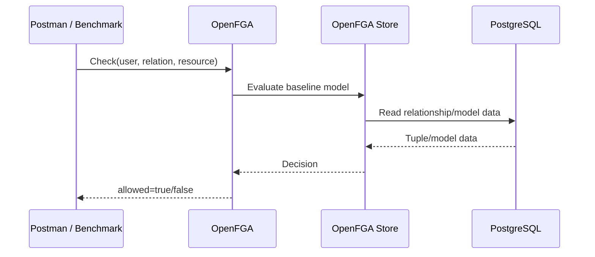

## Baseline-check

```mermaid
sequenceDiagram
    participant Client as Postman / Benchmark
    participant FGA as OpenFGA
    participant Store as OpenFGA Store
    participant PG as PostgreSQL

    Client->>FGA: Check(user, relation, resource)
    FGA->>Store: Evaluate baseline model
    Store->>PG: Read relationship/model data
    PG-->>Store: Tuple/model data
    Store-->>FGA: Decision
    FGA-->>Client: allowed=true/false
```