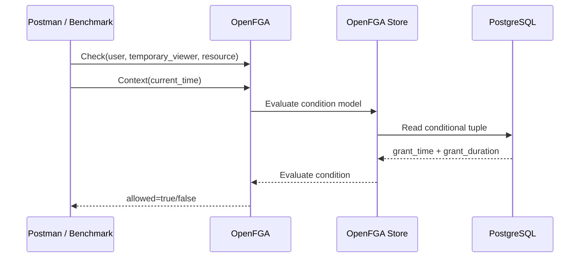

## Conditions

```mermaid
sequenceDiagram
    participant Client as Postman / Benchmark
    participant FGA as OpenFGA
    participant Store as OpenFGA Store
    participant PG as PostgreSQL

    Client->>FGA: Check(user, temporary_viewer, resource)
    Client->>FGA: Context(current_time)
    FGA->>Store: Evaluate condition model
    Store->>PG: Read conditional tuple
    PG-->>Store: grant_time + grant_duration
    Store-->>FGA: Evaluate condition
    FGA-->>Client: allowed=true/false
```

- So OpenFGA evaluates following condition:
```
stored:
    grant_time
    grant_duration
    relationship

request:
    current_time
```