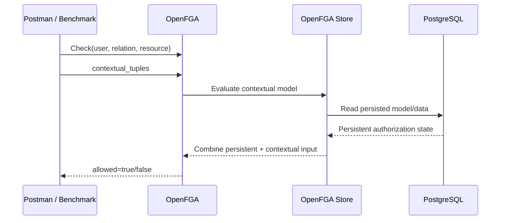

## Contextual tuples

```mermaid
sequenceDiagram
    participant Client as Postman / Benchmark
    participant FGA as OpenFGA
    participant Store as OpenFGA Store
    participant PG as PostgreSQL

    Client->>FGA: Check(user, relation, resource)
    Client->>FGA: contextual_tuples
    FGA->>Store: Evaluate contextual model
    Store->>PG: Read persisted model/data
    PG-->>Store: Persistent authorization state
    Store-->>FGA: Combine persistent + contextual input
    FGA-->>Client: allowed=true/false
```