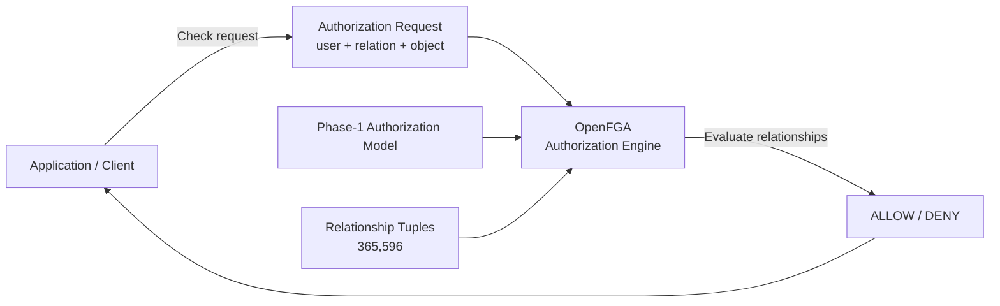
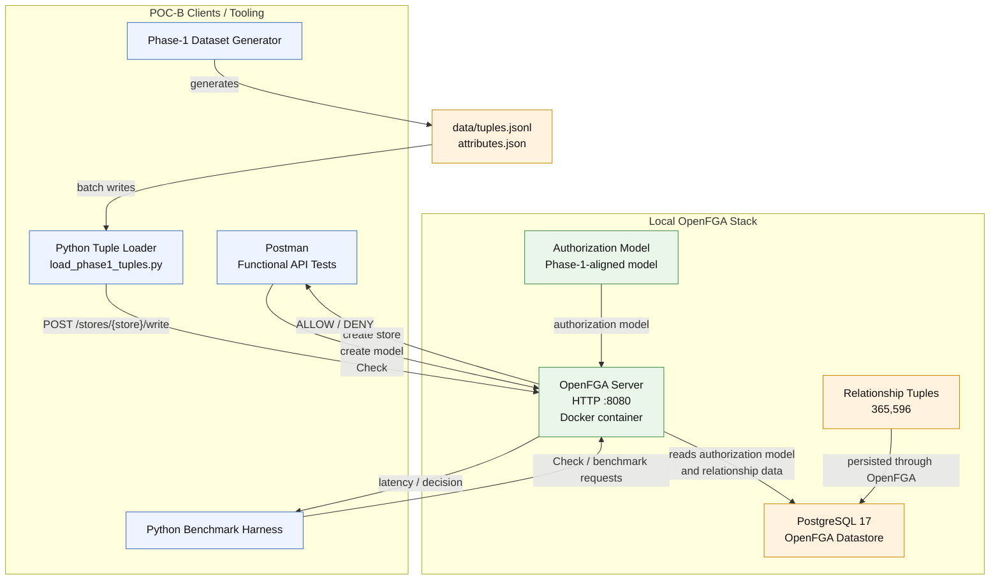

## Runtime evaluation

## Runtime flow
```
Request
   ↓
OpenFGA
   ├── Authorization Model
   └── Relationship Tuples
          ↓
      Relationship evaluation
          ↓
      ALLOW / DENY
```

----------------------------------------------------
# Additional (runtime specific - full flow)
----------------------------------------------------

## Current runtime architecture


### Real data flow
```
generate_tuples.py
        ↓
tuples.jsonl
        ↓
load_phase1_tuples.py
        ↓
OpenFGA /write
        ↓
PostgreSQL
```
### Authorization
```
benchmark/Postman
        ↓
OpenFGA /check
        ↓
PostgreSQL + authorization model
        ↓
ALLOW / DENY
```