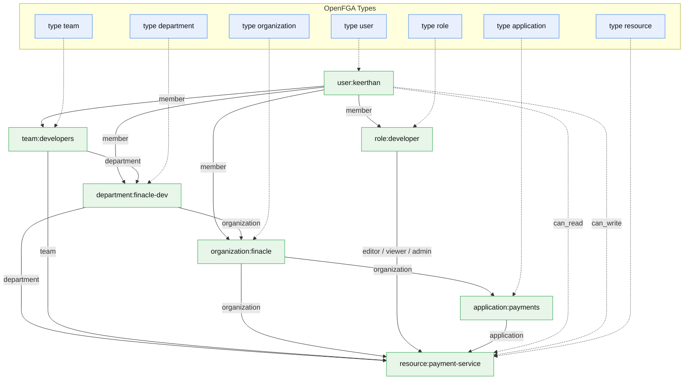

## OpenFGA Objects, Types, Relations and Tuples

```mermaid
flowchart TB

    %% =========================
    %% TYPES
    %% =========================

    subgraph TYPES["OpenFGA Types"]
        USER_TYPE["type user"]

        ORG_TYPE["type organization"]
        DEPT_TYPE["type department"]
        TEAM_TYPE["type team"]

        ROLE_TYPE["type role"]

        APP_TYPE["type application"]
        RESOURCE_TYPE["type resource"]
    end

    %% =========================
    %% USER
    %% =========================

    USER["user:keerthan"]

    %% =========================
    %% ORG
    %% =========================

    ORG["organization:finacle"]

    %% =========================
    %% DEPT
    %% =========================

    DEPT["department:finacle-dev"]

    %% =========================
    %% TEAM
    %% =========================

    TEAM["team:developers"]

    %% =========================
    %% ROLE
    %% =========================

    ROLE["role:developer"]

    %% =========================
    %% APPLICATION
    %% =========================

    APP["application:payments"]

    %% =========================
    %% RESOURCE
    %% =========================

    RESOURCE["resource:payment-service"]

    %% =========================
    %% RELATIONSHIPS
    %% =========================

    USER -->|"member"| TEAM
    USER -->|"member"| DEPT
    USER -->|"member"| ORG
    USER -->|"member"| ROLE

    TEAM -->|"department"| DEPT
    DEPT -->|"organization"| ORG

    DEPT -->|"department"| RESOURCE
    TEAM -->|"team"| RESOURCE
    ORG -->|"organization"| RESOURCE

    ROLE -->|"editor / viewer / admin"| RESOURCE

    APP -->|"application"| RESOURCE
    ORG -->|"organization"| APP

    %% =========================
    %% RELATION RESOLUTION
    %% =========================

    USER -.->|"can_read"| RESOURCE
    USER -.->|"can_write"| RESOURCE

    %% =========================
    %% TYPE DEFINITIONS
    %% =========================

    USER_TYPE -.-> USER
    ORG_TYPE -.-> ORG
    DEPT_TYPE -.-> DEPT
    TEAM_TYPE -.-> TEAM
    ROLE_TYPE -.-> ROLE
    APP_TYPE -.-> APP
    RESOURCE_TYPE -.-> RESOURCE

    classDef type fill:#e8f0fe,stroke:#4285f4,color:#111;
    classDef object fill:#e8f5e9,stroke:#34a853,color:#111;
    classDef decision fill:#fff3e0,stroke:#fb8c00,color:#111;

    class USER_TYPE,ORG_TYPE,DEPT_TYPE,TEAM_TYPE,ROLE_TYPE,APP_TYPE,RESOURCE_TYPE type;
    class USER,ORG,DEPT,TEAM,ROLE,APP,RESOURCE object;
```