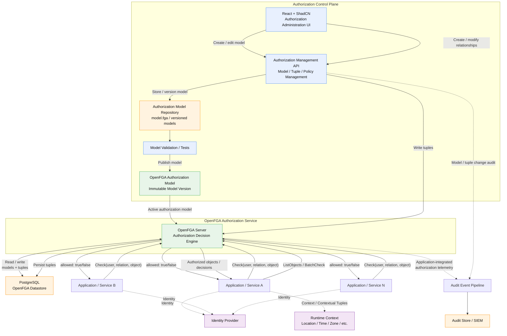

## Runtime/Deployment Architecture


## openfga
```
Application
     ↓
OpenFGA
     ↓
Authorization datastore
     ↓
relationship evaluation
     ↓
decision
```

## Conceptual Evaluation Flow

                        AUTH REQUEST
                             │
           ┌─────────────────┼─────────────────┐
           │                 │                 │
        Subject           Resource           Context
           │                 │                 │
           ▼                 ▼                 ▼
      User / Role       Resource attrs     Location
      Department        Classification     Time
      Team              Department         Event Zone
      Clearance         Team              etc.
           │                 │                 │
           └─────────────────┼─────────────────┘
                             ▼
                      Rego Policy
                             │
                             ▼
                       OPA Evaluation
                             │
                             ▼
                    Structured Decision