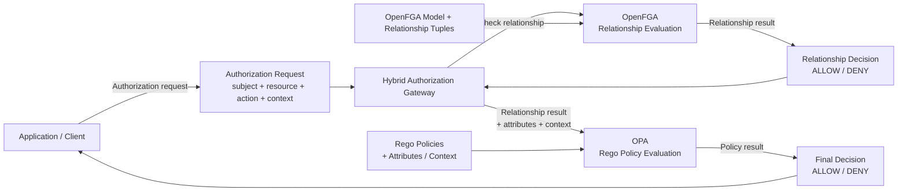

## Hybrid OpenFGA + OPA runtime evaluation


## Runtime flow
```
Authorization Request
        ↓
Hybrid Gateway
        ↓
OpenFGA
        ↓
Relationship Decision
        ↓
OPA / Rego
        ↓
Attribute + Context Policy Evaluation
        ↓
Final ALLOW / DENY
```

## Decision composition 
```
OpenFGA = relationship authorization

OPA = attribute / contextual policy

Final:
    OpenFGA ALLOW
        AND
    OPA ALLOW
        ↓
      ALLOW
```
## Scenario
```
OpenFGA DENY → DENY

OpenFGA ALLOW + OPA DENY → DENY
```