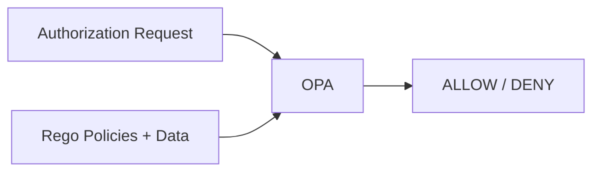
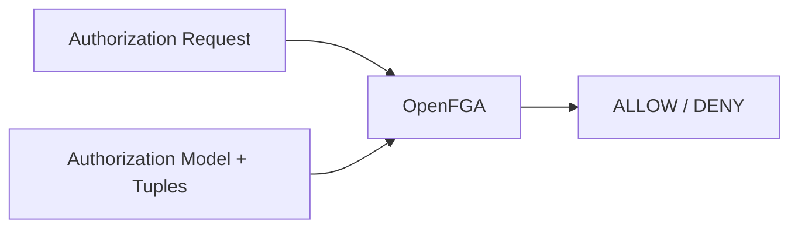
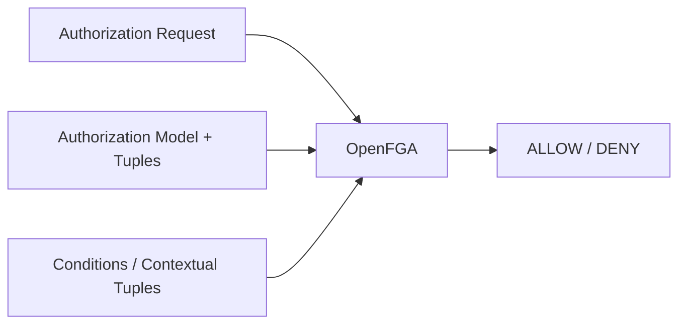
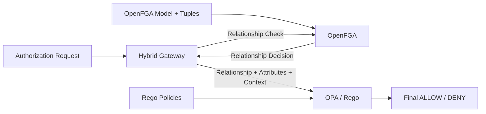

## POC A - OPA + Rego


## POC-B Phase 1 — OpenFGA


## POC-B Phase 2 — OpenFGA


## POC-B Phase 1 — OpenFGA


## Additional
```
OPA
 │
 └── Policy evaluation

OpenFGA
 │
 └── Relationship evaluation

OpenFGA Phase 2
 │
 ├── Relationship evaluation
 └── Conditions / Context

Hybrid
 │
 ├── OpenFGA → Relationship
 └── OPA     → Policy / Attributes / Context
```