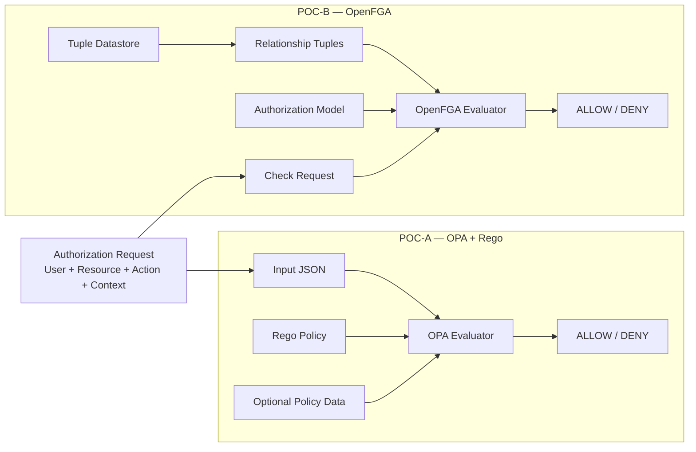

## OPA vs OpenFGA
```
OPA:

request
  ↓
input JSON
  ↓
Rego policy
  ↓
decision
```

```
OpenFGA:

request
  ↓
authorization model
  +
relationship tuples
  ↓
relationship evaluation
  ↓
decision
```

## Architecture Comparison


## OPA - Policy-centric
It asks: `Given these attributes and this context, what does the policy say?`

```
    Subject
    +
    Resource
    +
    Action
    +
    Context
            ↓
        Rego
            ↓
        Decision
```

## OpenFGA - Relationship-centric
It asks: `Does this subject have the required relationship with this object?`

```
    Subject
        ↓
    Relationship graph
        ↓
    Resource
        ↓
    Relation
        ↓
    Decision
```

## V2 - Eventual split idea

```
                  Authorization Request
                           │
                 ┌─────────┴─────────┐
                 │                   │
                 ▼                   ▼
             OpenFGA              OPA/Rego
         Relationship logic      Policy logic
                 │                   │
                 │                   │
                 └─────────┬─────────┘
                           ▼
                    Decision Combiner
                           │
                    ALLOW / DENY
```

`example` :
```
`OpenFGA:` 
"Is Keerthan a member of the Dev Team that has access to this resource?"

               AND

`OPA:` 
"Does Keerthan have sufficient clearance, is he in the correct location, and is access currently permitted?"

               ↓

          FINAL DECISION
```