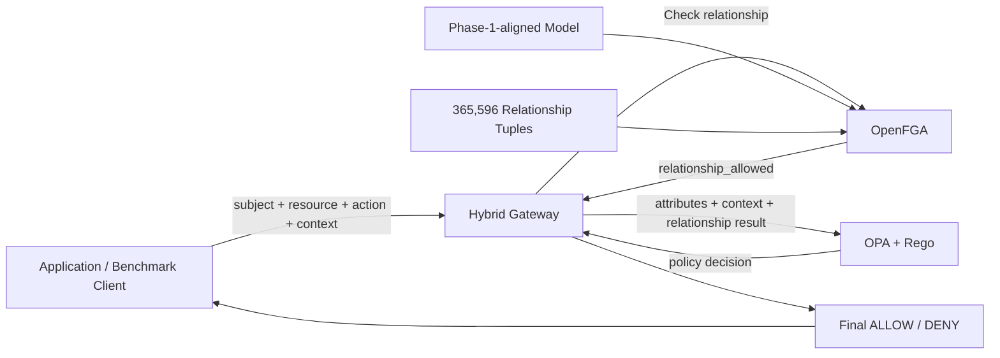

# POC-C Current Runtime Architecture


```mermaid
flowchart LR
    CLIENT["Application / Benchmark Client"]
    GW["Hybrid Gateway"]
    FGA["OpenFGA"]
    MODEL["Phase-1-aligned Model"]
    TUPLES["365,596 Relationship Tuples"]
    OPA["OPA + Rego"]
    DECISION["Final ALLOW / DENY"]

    CLIENT -->|"subject + resource + action + context"| GW
    GW -->|"Check relationship"| FGA
    MODEL --> FGA
    TUPLES --> FGA
    FGA -->|"relationship_allowed"| GW
    GW -->|"attributes + context + relationship result"| OPA
    OPA -->|"policy decision"| GW
    GW --> DECISION
    DECISION --> CLIENT
```

Final decision:

```text
OpenFGA ALLOW AND OPA ALLOW = ALLOW
otherwise = DENY
```
